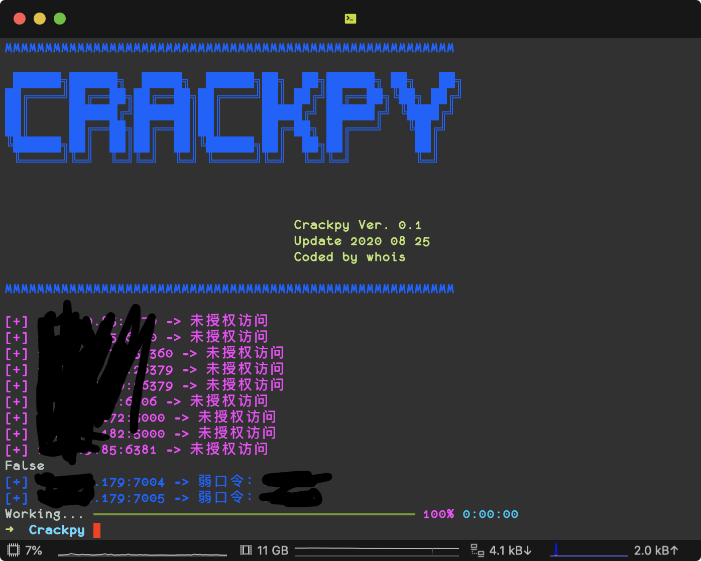

# 🌀 Crackpy   [](http://www.python.org/download/) 

弱口令爆破和未授权访问工具。*现在还一堆问题，慢慢更新*




## 1. Install
```
git clone https://github.com/j3ers3/Crackpy
pip3 install -r requirements.txt
```

## 2. Usage
```
optional arguments:
  -h, --help  show this help message and exit

MODULES:
  -m MODULE   Speciy module [mysql|redis|mongo|ftp|ssh|telnet]

MISC:
  -f IPFILE   Speciy host file [1.1.1.1:3306]
  -x HOST     Specify single host [1.1.1.1:3306]
  -t THREADS  Set thread (default 20)
```

- 示例 python crackpy.py -m mysql -x 1.1.1.1

> tips 不指定端口就使用默认端口

